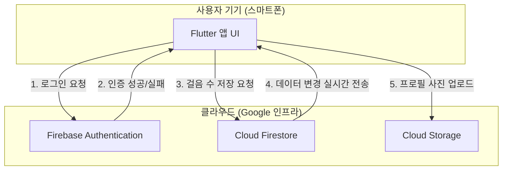

# 아키텍처 가이드: Flutter와 Firebase

이 문서는 Flutter를 프론트엔드(Frontend)로, Firebase를 백엔드(Backend)로 사용하는 최신 앱 아키텍처의 개념과 장점을 설명합니다.

## 1. 역할 분담: 프론트엔드와 백엔드

앱 개발은 크게 두 가지 영역으로 나뉩니다.

### **프론트엔드 (Frontend): Flutter**

-   **역할**: 사용자가 직접 보고 상호작용하는 모든 부분. 즉, 앱의 '얼굴'입니다.
-   **주요 책임**:
    -   **UI/UX**: 화면의 레이아웃, 버튼, 이미지 등 시각적 요소를 구성합니다.
    -   **사용자 상호작용**: 버튼 클릭, 스크롤, 텍스트 입력 등 사용자의 행동을 감지하고 처리합니다.
    -   **상태 관리**: 앱 내부의 데이터(예: 현재 걸음 수, 로그인 상태)를 관리하고 화면에 반영합니다.
    -   **백엔드와의 통신**: 필요할 때 백엔드에 데이터를 요청하거나 전송하는 역할을 합니다.

### **백엔드 (Backend): Firebase**

-   **역할**: 사용자 눈에는 보이지 않지만, 앱이 제대로 동작하는 데 필요한 서버 측 기능을 담당합니다. 앱의 '두뇌'이자 '창고'입니다.
-   **주요 책임**:
    -   **데이터베이스 (`Cloud Firestore`)**: 앱의 모든 데이터(사용자 정보, 게시물, 걸음 수 기록 등)를 안전하게 저장, 관리, 제공합니다.
    -   **사용자 인증 (`Firebase Authentication`)**: 로그인, 회원가입, 소셜 로그인 등 복잡하고 보안이 중요한 사용자 인증 기능을 처리합니다.
    -   **파일 저장소 (`Cloud Storage`)**: 사용자가 업로드하는 이미지, 동영상 등의 대용량 파일을 저장합니다.
    -   **서버리스 함수 (`Cloud Functions`)**: 특정 조건(예: 데이터베이스에 새 글이 추가되면)에서 자동으로 실행되는 서버 코드를 실행합니다.

---

## 2. 상호작용 방식: 어떻게 함께 동작하는가?

Flutter와 Firebase는 '서버리스(Serverless)' 아키텍처를 통해 매우 효율적으로 협력합니다. 개발자가 직접 서버를 만들고 관리할 필요가 없다는 의미입니다.



**데이터 흐름 예시 (만보기 앱):**

1.  **로그인 (인증)**: 사용자가 Flutter 앱에서 이메일/비밀번호를 입력하고 '로그인' 버튼을 누릅니다. Flutter는 이 정보를 `Firebase Authentication`에 전달합니다.
2.  **인증 처리**: `Firebase Authentication`은 정보가 올바른지 확인하고 결과를 Flutter 앱에 알려줍니다.
3.  **데이터 저장**: 사용자가 걸음 수를 저장하면, Flutter 앱은 이 데이터를 `Cloud Firestore` 데이터베이스에 "이 사용자의 걸음 수는 OOO이다"라고 기록해달라고 요청합니다.
4.  **실시간 업데이트**: `Cloud Firestore`에 데이터가 변경되면, 데이터베이스는 이 변경사항을 실시간으로 구독하고 있는 모든 기기(Flutter 앱)에 즉시 알려줍니다. Flutter 앱은 이 정보를 받아 화면을 자동으로 새로고침하여 최신 걸음 수를 보여줍니다.

---

## 3. 핵심 장점

-   **빠른 개발 속도**: 로그인, 데이터베이스 등 복잡한 백엔드 기능을 직접 구현할 필요 없이, Firebase가 제공하는 강력한 SDK(소프트웨어 개발 키트)를 호출하기만 하면 됩니다. 이를 통해 프론트엔드 개발에 더 집중할 수 있습니다.
-   **뛰어난 확장성**: 사용자가 수십만 명으로 늘어나도 Google의 강력한 인프라가 알아서 서버를 증설하고 트래픽을 감당해 줍니다.
-   **비용 효율성**: 초기에는 대부분 무료로 사용 가능하며, 사용량이 늘어남에 따라 사용한 만큼만 비용을 지불하는 합리적인 구조입니다.
-   **실시간 기능 구현 용이**: `Firestore`의 실시간 동기화 기능 덕분에 채팅 앱이나 협업 도구처럼 데이터가 즉시 반영되어야 하는 기능을 매우 쉽게 만들 수 있습니다.
-   **높은 보안성**: Firebase는 데이터베이스 접근 규칙 등을 통해 데이터를 안전하게 보호할 수 있는 다양한 보안 기능을 제공합니다.

---

## 4. Firebase 생성 및 설정

Flutter 앱과 Firebase 백엔드를 연결하는 과정은 간단하며, `FlutterFire`라는 도구를 통해 대부분 자동화할 수 있습니다.

### **1단계: Firebase 프로젝트 생성 (웹 콘솔)**

1.  [Firebase 콘솔](https://console.firebase.google.com/)로 이동하여 Google 계정으로 로그인합니다.
2.  **'프로젝트 추가'** 버튼을 클릭합니다.
3.  프로젝트 이름을 입력하고 안내에 따라 새 프로젝트를 생성합니다. Google Analytics 사용 여부는 선택 사항입니다.

### **2단계: FlutterFire CLI 설치 및 로그인**

`FlutterFire CLI`는 Flutter 프로젝트와 Firebase 프로젝트를 연결하는 명령줄 도구입니다. 이 개발 환경에는 기본적으로 설치되어 있습니다.(Firebase Studio 혹은 VSCode)

터미널에서 다음 명령어를 실행하여 Firebase에 로그인합니다.

```bash
firebase login
```

### **3단계: Flutter 프로젝트와 Firebase 프로젝트 연결**

1.  터미널에서 Flutter 프로젝트의 루트 디렉토리로 이동합니다.
2.  다음 명령어를 실행합니다.

    ```bash
    flutterfire configure
    ```

3.  명령어를 실행하면, 로그인된 계정의 Firebase 프로젝트 목록이 나타납니다. 위에서 생성한 프로젝트를 선택합니다.
4.  연결할 플랫폼(android, ios, web 등)을 선택하라는 메시지가 나타납니다. 원하는 플랫폼을 선택하면 `FlutterFire`가 플랫폼별 설정을 자동으로 처리합니다.
5.  이 과정이 완료되면 `lib/firebase_options.dart` 파일이 생성됩니다. **이 파일은 절대 직접 수정해서는 안 됩니다.** 이 파일에는 Flutter 앱이 Firebase 프로젝트를 식별하는 데 필요한 모든 구성 정보(API 키 등)가 들어있습니다.

### **4단계: Flutter 앱에서 Firebase 초기화**

앱이 시작될 때 Firebase와 통신할 수 있도록 초기화 코드를 추가해야 합니다.

1.  `pubspec.yaml` 파일에 `firebase_core` 패키지가 있는지 확인하고 없다면 추가합니다.

    ```bash
    flutter pub add firebase_core
    ```

2.  `lib/main.dart` 파일의 `main` 함수를 다음과 같이 수정합니다.

    ```dart
    import 'package:flutter/material.dart';
    import 'package:firebase_core/firebase_core.dart';
    import 'firebase_options.dart'; // flutterfire configure가 생성한 파일

    void main() async {
      // Flutter 엔진과 위젯 바인딩을 초기화합니다.
      WidgetsFlutterBinding.ensureInitialized();

      // Firebase를 초기화합니다.
      await Firebase.initializeApp(
        options: DefaultFirebaseOptions.currentPlatform,
      );

      runApp(const MyApp());
    }
    ```

이제 Flutter 앱은 Firebase의 모든 서비스(인증, 데이터베이스 등)를 사용할 준비가 되었습니다.
